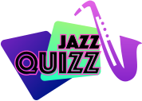
# JazzQuizz!
Welcome to Jazz Quizz, a game for jazz music passionate. In this game users can test their knowledge of jazz by answering to ten questions which each question has three options to choose from. The users will not get a feedback immediately but at the end of the quiz in the Score page they will find out their score. The correct answer is not specified, this will lead the users to retry to get the correct answers and a higher score. 

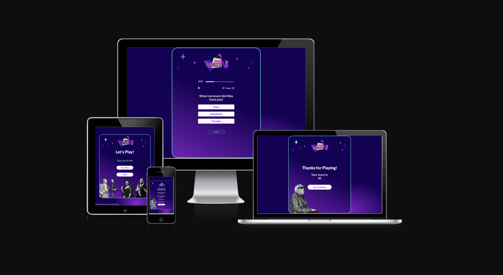

___

# Table of Contents

- [Overview](#Overview)
    * [Strategy and Goals](#strategy-and-goals) 
- [User Experience](#user-experience)
    * [User Stories](#user-stories) 
    * [Wireframe mockups](#wireframe-mockups) 
- [User Interface](#user-interface)
    * [Color scheme](#color-scheme) 
    * [Typography](#Typography)
    * [Logo](#logo)
 - [Structure](#structure) 
    * [Start screen](#start-screen) 
    * [Displays](#displays)
    * [Questions screen](#Questions-screen)  
    * [Score screen](#score-screen)    
- [Testing](#testing)
    * [Accessibility](#accessibility)
    * [Validators Testing](#validators-testing)
- [Technologies](#technologies) 
- [Credits](#credits)
- [Deployment](#deployment)
- [Future Scope](#future-scope)
- [Bugs](#bugs)
- [Acknowledgements](#acknowledgements)

---

# Overview
  ## Strategy and Goals
Jazz Quizz is an amusement app is designed for users passionate about music, in particular Jazz. The information is displayed on a single page that dynamically changes depending on user activity. The user will need to answer to 10 questions in order to complete the quiz.

The goal is to design and develop an engaging app that entertains the user and at the same time inform them.

The design is straightforward, vertical, and responsive to all screen sizes. Amusing sound effects and eye-catching images to make the experience enjoyable. Clear presentation of the information and intuitive navigation through the interface, simplified by easy to press buttons on both touch screen and mobile devices.

# User Experience
  ## User Stories
- As a user, I want to be able to simply navigate the page.
- As a user, I want to be able to read and understand the game's rules. 
- As a user, I want to be able to track my progress.- As a user, I want to be able to see the scores I am gaining.
- As a user, I want to be able to be aware of how many questions remain to be answered. 
- As a user, I want to be able to play and pause audio.
- As a user, I want to be able to see a final score after answering the final question.
- As a user, I want to be able to go back to home page once the game has finished.

  ## Wireframe mockups

  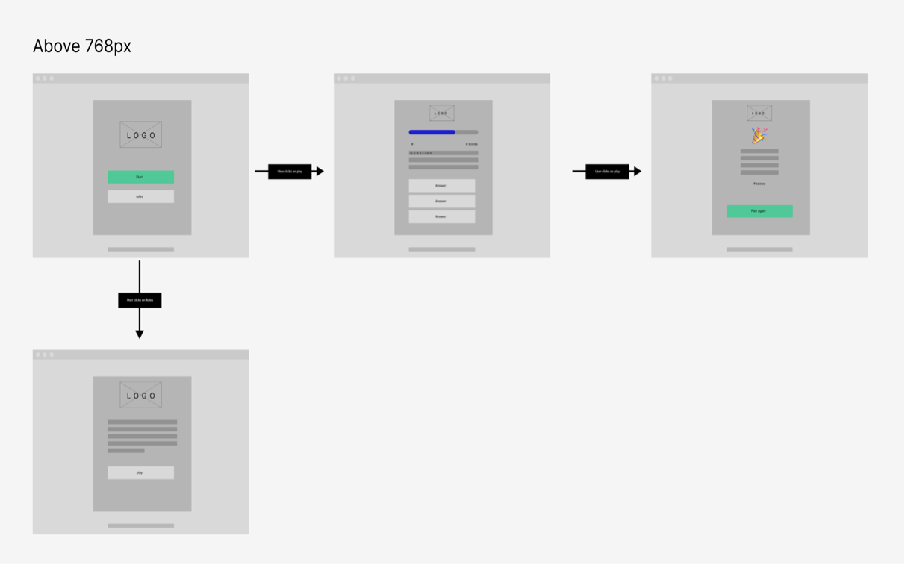

# User Interface

  ## Color scheme
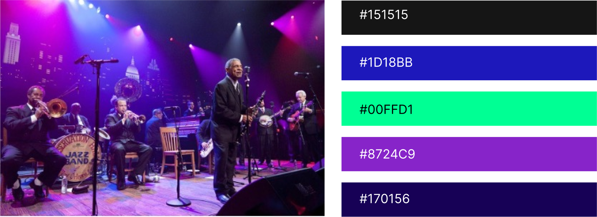
The color scheme is inspired by the colors of the lighting used on the stage where jazz bands typically perform. The purple #8724C9 is the primary color, dominant in the UI, it is used on the background as a gradient meshed with #170156, on the buttons text and when hovering on the buttons. Secondary color is #00FFD1, used in component like the progress bar and icons.

  ## Typography
- The font used in the entire project is Lato.
- Lato is a modern, sleek and clean looking font sourced from [Google Fonts](https://fonts.google.com/specimen/Lato).
- The font has been adopted in the selected weight: regular, light and bold.

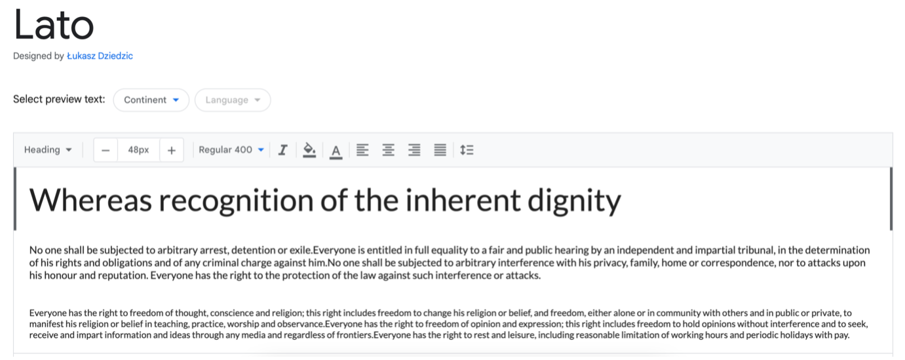
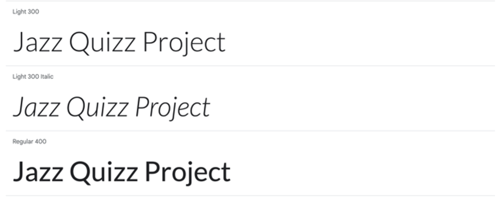

 ## Logo

The logo is personally created playing with the word Jazz and Quiz, by adding the Z at the end of the word “Quiz”. On the background of the logo I’ve positioned a couple of cards, typical elements in games,  and a saxophone, a popular instrument utilized in Jazz music. The font reminds the neon signs outside the jazz bars. 

The logo was realized in Figma and exported in .svg for a better resolution.

# Structure
The page has a fairly straightforward design. Every page has a logo on the top part with stars and musical notes as decorations. I have to tell that the logo is clickable on the Start and Rouls pages only, because I want to avoid the user to go back while playing.
 ## Start screen
The start screen design is characterized by black and white cutouts of famous Jazz artists.The main content is presented in the center of the screen and framed by a rectangle with rounded corners, to create dept from the gradient background.

The top part is dominated by the logo, while below it there is a header with a message to the user to incentivize to play the game.

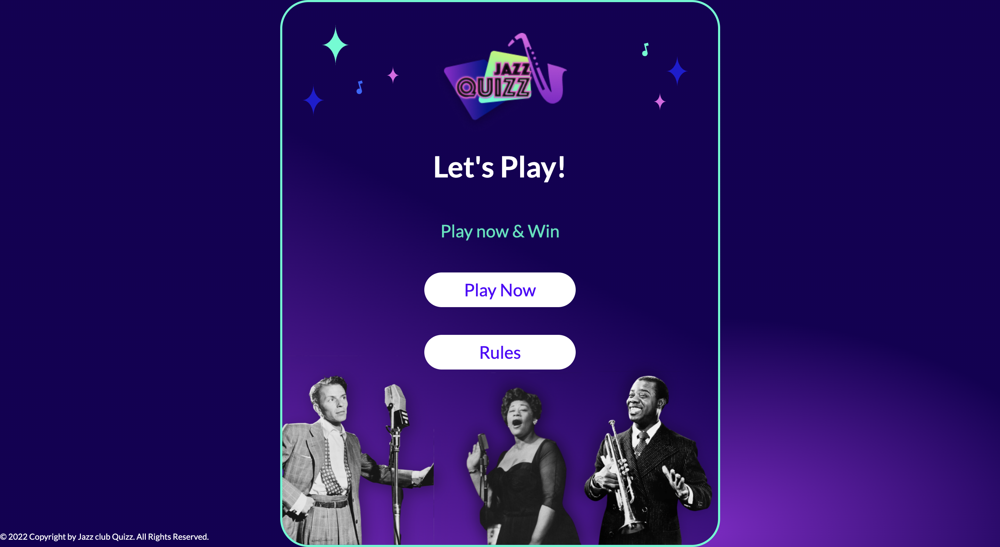

The screen presents only two buttons: ”Play Now” and ”Rules”.

If user clicks on “Play Now”, the game will start.

If user clicks on “Rules” the information about how to play are displayed, so that the user can understand the rules of the quiz.

After reading the rules, the user can directly play without going back to the previous screen. 

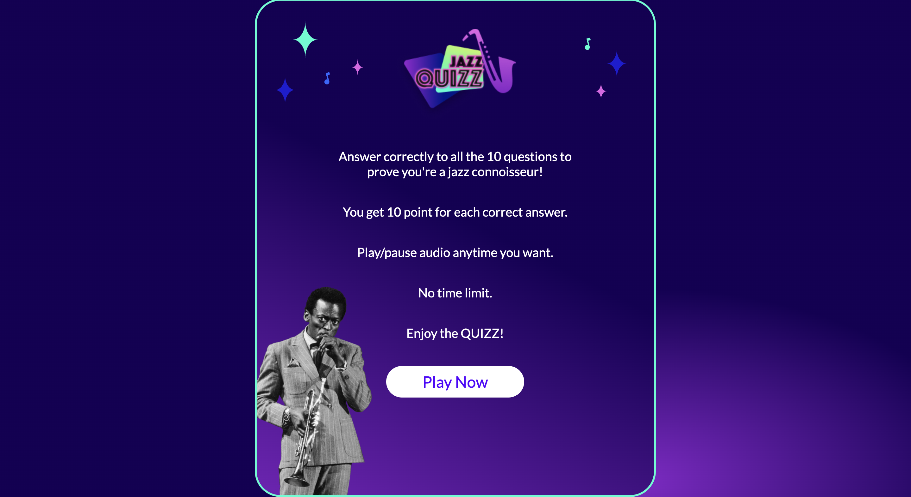

  ## Displays
  The design reveals an informative controls section where users can follow their progress and pause/play the theme tune while the start screen buttons and logo are hidden. A question counter, user score, and a play/pause button are located on the left, right, and between, respectively.
   
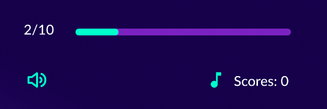

  ## Questions screen
  The questions screen is characterized by a simple layout divided in 2 section: the top is dedicated to the controls, which includes the progress bar, scores, and music controller. 

  The bottom part is dedicated to the questions and the answers buttons. The user will face 3 answers to choose from. 

  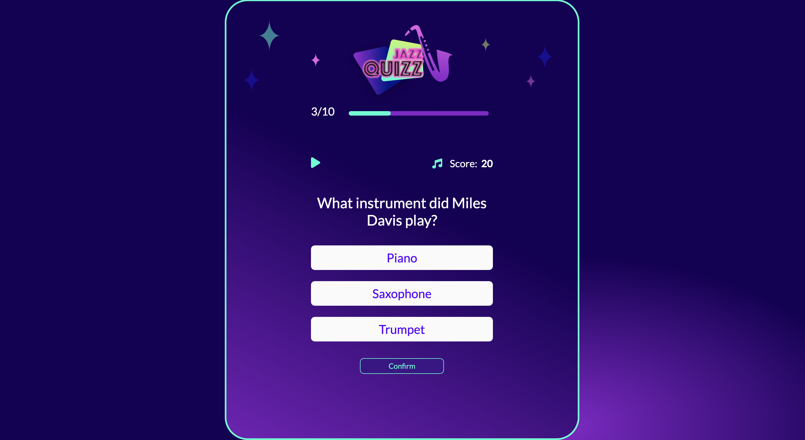

  The user cannot continue to the next question until they choose an option, after that they can press the "Confirm" button to proceed. 

  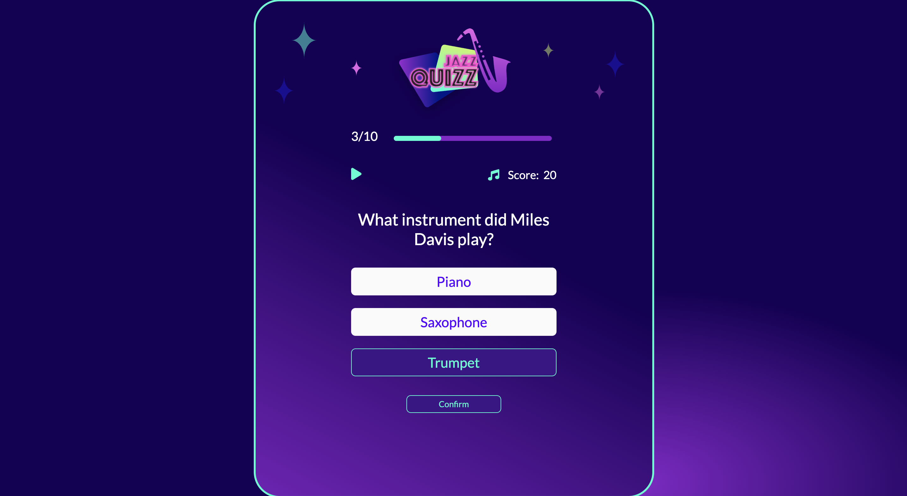
  
  ## Score screen
  Once the users completes all the questions, they will face the "score page" wich will summarise their results. The Score is a number between 0 and 100 , where 100 is the maximum achievement.

  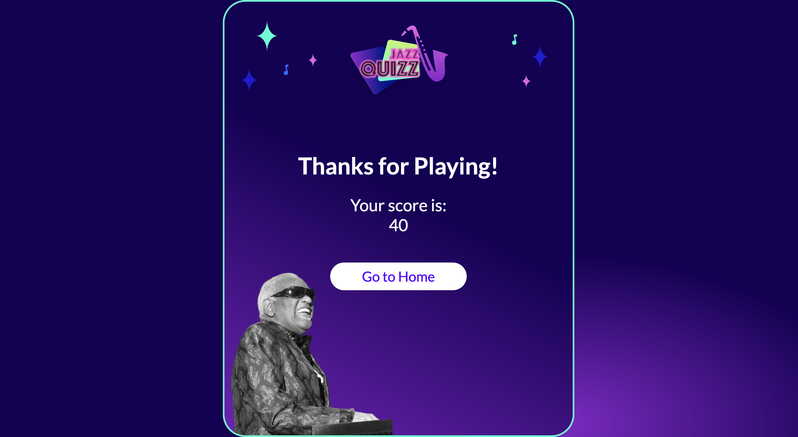 

# Testing
  ## Accessibility
  Accessibility was run during design on Figma with the plug in “Use contrast”  in order to make sure the color contrast was meeting the WCAG standards.

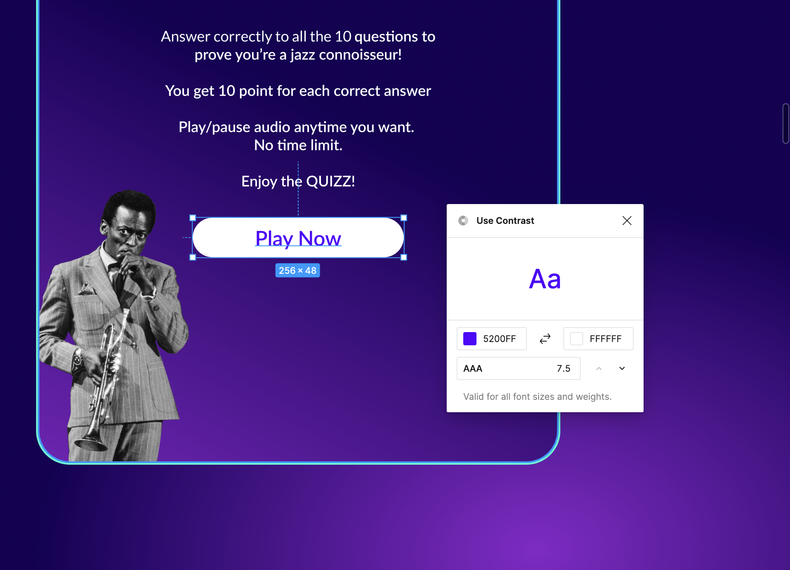

  ## Validators Testing
  - HTML
    - No errors were returned when passing through the official [W3C validator](https://validator.w3.org/)
    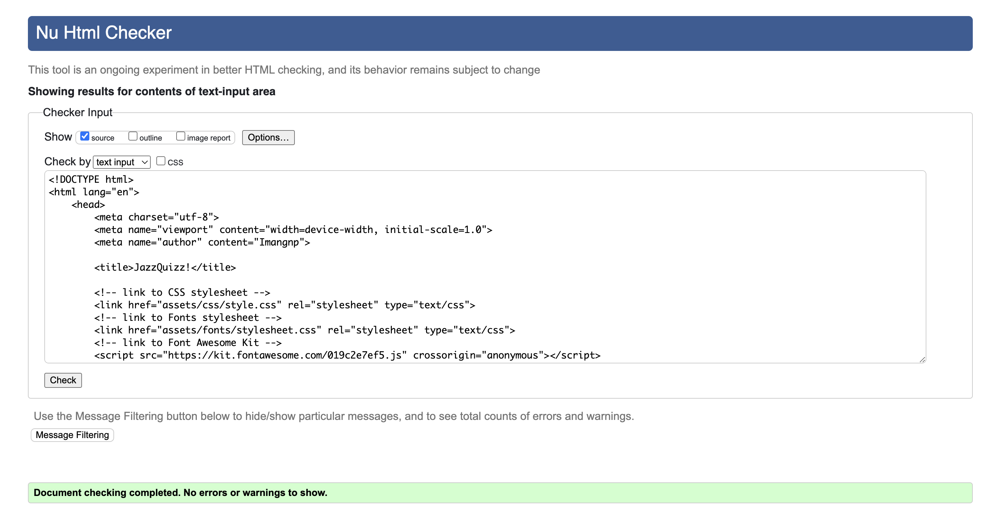
- CSS
    - No errors were found when passing through the official [Jigsaw validator](https://jigsaw.w3.org/)
    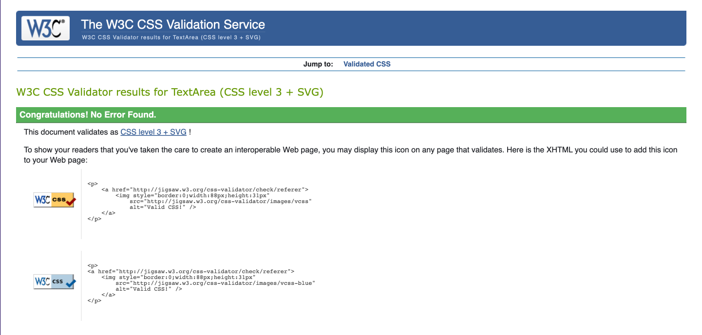
- JavaScript (JSHint)
    - No errors were found when passing through the official [JSHint](https://jshint.com/). Except three informativ messages that my mentor defined as usual messages. 
    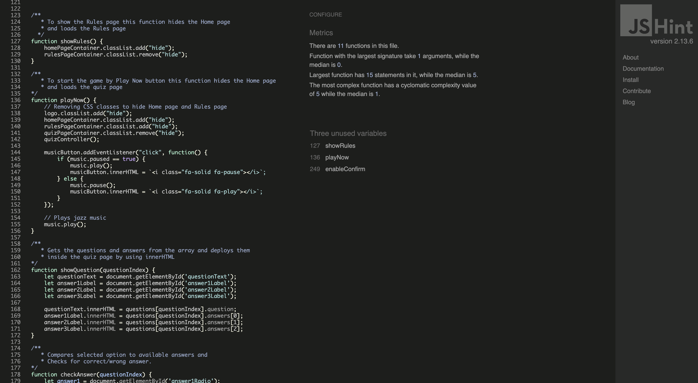
- Lighthouse Testing
    - I confirm that the colors and fonts choosen are easy to read and accessible by running it through light house in devtools.
    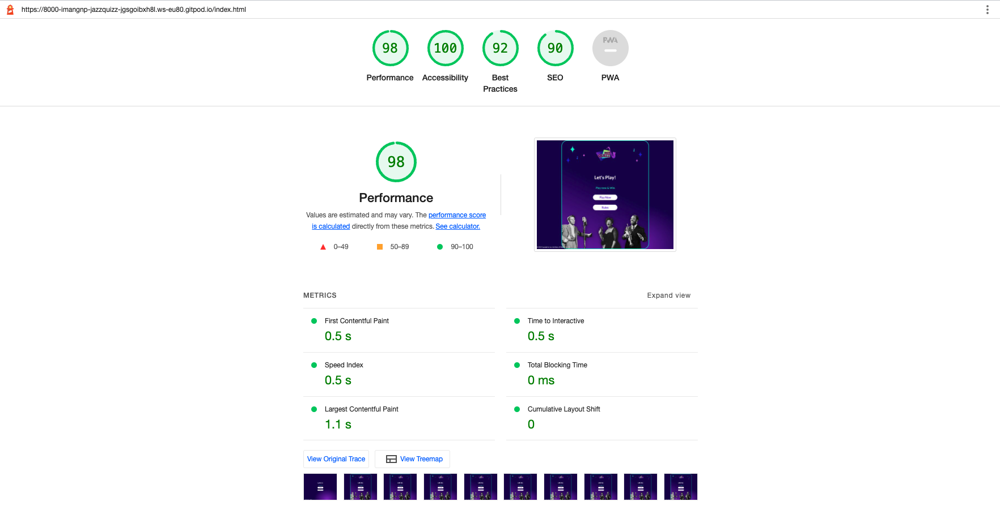

# Technologies
- Languages: 
  - HTML
  - CSS
  - JavaScript

# Credits

- [Figma](https://www.figma.com/) is the design tool I’ve adopted for the wireframe design first, the colour palette and the final design. All the graphic elements such as Logo, icons, pictures are created, edited, and exported from Figma. 
- [Useful trivia](https://www.usefultrivia.com/) is the source of the questions that I used in the quiz.
- [Png egg](https://www.pngegg.com/) where the images in the background are downloaded from.
- [Videvo](https://www.videvo.net/) provided royalty free music.
- [Use contrast](https://www.figma.com/community/plugin/1149686177449921115/Use-Contrast)  is a plug in that allows to check the contrast on a very fist stage during design. 
- [Google Fonts](https://fonts.google.com/specimen/Lato) The font “Lato” is downloaded from google fonts and uploaded into the style.css file applied to all of the pages. 
- [Fontawesome](https://fontawesome.com/) where icons used in the display are exported from.
- [Favicon.io](https://favicon.io) tool used to create favicon.
- [W3C validator](https://validator.w3.org/) is used to validate the HTML code.
- [Jigsaw validator](https://jigsaw.w3.org/) is used to validate CSS styles.
- [JSHint](https://jshint.com/) is used to validate JavaScript logics.
- Lighthouse is used to test accessibility and performance.
- part of the code to pause/play the music was written thanks to the support and help of other students in the slack channel "#project-portfolio-2".

# Deployment
This quiz was deployed to [GitHub Pages](https://pages.github.com/).  The steps taken in deploying this project are as follows:

- Log in to GitHub and select 'JazzQuizz' from the list of repositories.
- Click on 'Settings' on the menu just below the repository's name.
- Navigate to the left side menu and click on 'Pages' in the 'Code and Automation' section.
- In the Main area under 'Build and Deployment', click on the source dropdown menu and select the 'Deploy from Branch' selection.
- In the 'Branch' section select the `main` branch and the `/(root)` folder.
- Click 'Save'.
- After refreshing a message with the link will appear at the top of the page indicating that the deployment was succesful and your site is live.

# Future Scope
In a future update of the quiz game, the user will face immediate feedback when selecting one of the options. 
If the answer is right the user will receive a positive feedback by facing a green colored button. If the answer is wrong, than the feedback will be negative (red color).
The "Confirm" button will no more be needed, because after the instant feedback, the page will move to the next question automatically.

 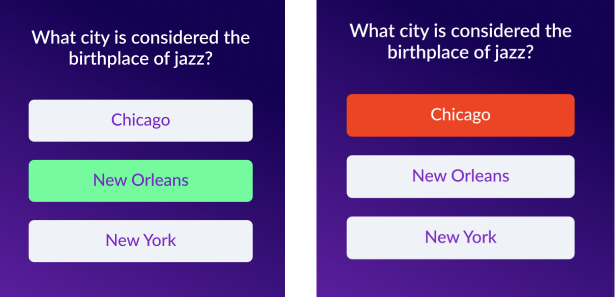

# Bugs

### - Problem:
 the user was able to confirm and move to the next question even without selecting any answer first. 

### Solution:
 I fixed with utilising two funcions to disable the button when no answer is chosen, and enable the button when the user choose one of the options. 

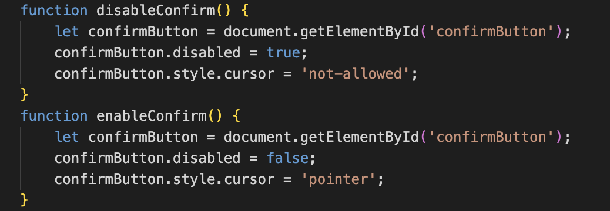

### - Problem:
 The music was not pausing when clicking on the pause icon. 
### Solution:
 Thanks to the Slack community for the insights,I solved by adding an onclick EventListener to the play/pause button.

### - Problem:
 The progress bar was not starting from the first question, it wasn't showing any number or progress until the use 
 ### Solution:
 My mentor suggested to create a separate function to update the progress on the progress bar.

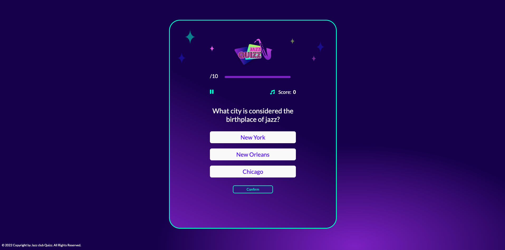

# Acknowledgements
- My mentor Akshat Garg for supporting me and helping during the development of this project.
- My wife for her precious help with Figma.
- Slack community that in every moment of day and night are present and helpful to solve problems.

[Back to Top](#)

---

